# My personal project: Spectrum emulator for ESP32

### David Crespo, March 2021
__________________________

In May 2020 a client of mine (I am a freelance programmer) asked me to evaluate an ESP32 microcontroller he wanted to use in his product; he was already using a PSOC for Bluetooth communication and now he needed WiFi and more power.

He handed me my first board (a DevKit ESP32-WRoom development board) and I began testing  features, getting familiar with the development environment, compiling and flashing tests ...

And I thought it was a powerful device within its limitations, so I started to investigate what else did people do with it.

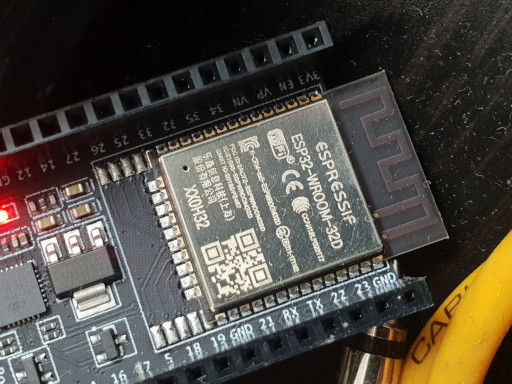

The first thing that caught my attention was the work of Bitluni ([https://bitluni.net/](https://bitluni.net/), where he managed to use programmable hardware to generate video signal.

The first thing I tried was a demo which generates a composite video signal (in black and white), so I flashed my ESP32 and connected it to my 14" TV (the one I use for the Spectrum), and I was amazed watching a polygonal demo of a Venus de Milo in 3D.

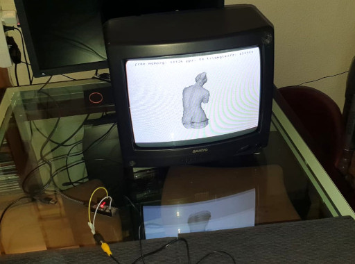

It also had color composite video demos, but they weren't stable. It was in color on some TVs, black and white in others...

Then I tried the VGA demos, first with digital RGB color (1 bit per R/G/B color component), connecting directly the R pin to the R pin of the DSUB15, the G to the G, the B to the B, HSync to HSync and VSync to VSync.

On Bitluni's github page there was [a circuit](https://github.com/bitluni/ESP32Lib/blob/master/Documentation/schematic.png) to achieve greater bit depth: create an R/2R DAC with resistors to achieve the highest color quality mode available: R5G5B4, with 5 bits for red, 5 for green and 4 for blue. After a few hours of soldering, wiring and mapping pins, I got to see the best color quality demos.

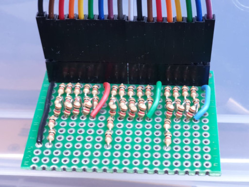

I tweaked a few demos to make sure the DAC was working properly, and while the luminance ramp wasn't perfectly linear, at least it was monotonously increasing.

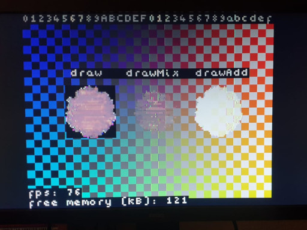

It was June 2020 and I had a minicomputer that could generate video, but nothing else. I wrote some demos, animations and things like that, but I needed something else, to connect some peripheral that would serve as an input device. I did some tests of connecting buttons and things like that, I thought about programming a game with few controls, making some kind of remote...

...and then I found a library that allowed me to read the wiimote from ESP (the ESP32-Wiimote from bigw00d). I already had an input device.

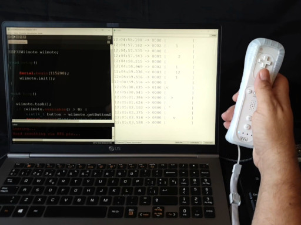

In the meantime, I purchased more ESP32s (specifically, the ESP32-WRover model with 4Mb of PSRam).

Then, I decided to make my own Spectrum emulator (my childhood computer, and the one responsible of what kind of work do I do now). But jumping into development, I did some research, and found the Rampa emulator (https://github.com/rampa069/ZX-ESPectrum), a working emulator. I flashed it and loaded Manic Miner and it worked perfectly. I had no way to control it, but the Manic Miner has a demo mode which shows all the screens and I loved seeing them on the VGA monitor.

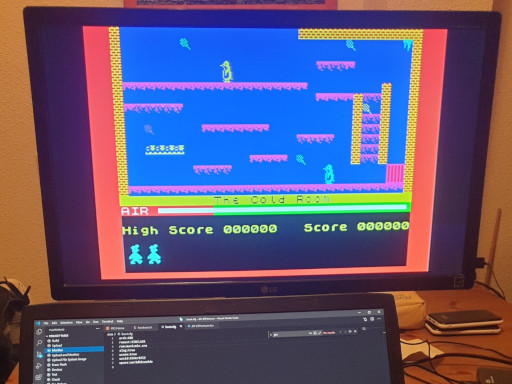

A keyboard was supposed to be connected, then I didn't know how at the moment. I made an attempt at hooking bare pins, but it didn't work (I learned why later).

So I decided to integrate the support for the Wii remote, which I already knew to work, to be able to operate the emulator. So I forked the project, and called it ZX-ESPectrum-Wiimote.

In July 2020 I managed to make the necessary modifications so that the emulator would use the Wii Remote as an input device. To do this I added, next to each game (ManicMiner.sna), a text file (ManicMiner.txt) containing the mapping of the Wiimote buttons to specific keys, with a mapping file for each game. The wiimote has a crosshair and 7 usable buttons, so it was relatively easy to run a lot of games.

I hadn't tested the PS/2 keyboard yet, so I tried to do my mod without breaking the existing keyboard support (which I had no way of testing). I made a pull request to the Rampa repo, which he included it in a separate branch, because I couldn't guarantee that the PS/2 keyboard was still working.

I started to make my changes in the emulator, at first minor things like the font (I programmed a converter to convert a PNG with a character set I downloaded), and began modifying things in the menu.

The next thing was to finally test the PS/2 keyboard. I had a couple of old PS/2 keyboards sitting around my house, and I made a bi-directional logic level converter with MOSFET transistors on a prototype board (actually it takes 2, one for the clock signal and one for the data).

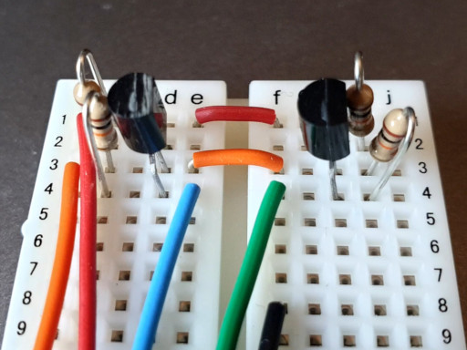

I connected my PS/2 keyboard to the pins of the ESP32 and it worked perfectly, it seems that I managed to integrate support for wiimote without breaking anything.

The emulator was functional, but it was mounted on a prototype board with all the cables hanging down and the components exposed, so I thought to go back to the foundations (the Spectrum) and mount the whole computer _inside_ the keyboard. I searched the internet for mini-size PS/2 keyboards and found one (the Periboard 409 mini) which I thought, based on the photos, that would fit the ESP32 and the wiring inside. I ordered it and received it in a few days.

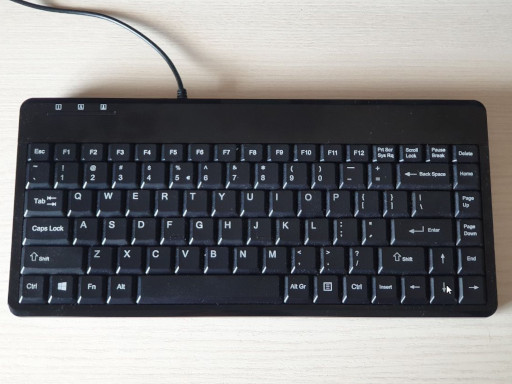

It was disappointing when I connected the keyboard to the ESP and did not work ... it didn't send commands when pressing keys. But the keyboard was operational, I connected it to an old laptop, and recognized the keystrokes without problems.

Investigating a bit more I discovered that during startup of a PS/2 keyboard, the keyboard controller send an initialization sequence, and the Rampa emulator module PS2KBD does not. I found a library (PS2KeyAdvanced by Paul Carpenter) that did, and integrated it into the emulator. I only use it to initialize the keyboard, but using it I can get my Periboard to work.

In August 2020 I began working on the compact ESPectrum. If it was going to fit, it would fit very tightly into the hole at the bottom rear that serves as a base to raise the keyboard ... I disassembled it, removed all the plastic reinforcements inside to make room for the ESP32 Devkit I used... and it looked like it would fit, bending the legs.

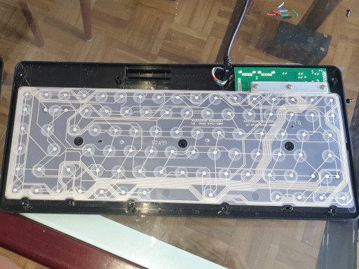

Due to the position of the ESP, I couldn't expose the microUSB connector towards the back of the keyboard (it didn't fit, so I had to think about an extension cord). As I did not feel able to solder (because of the small size) a female microUSB connector, I mounted a female type B USB, glued it with superglue to the case, and soldered a short piece of cable that ended in a male microUSB that plugs into the ESP .

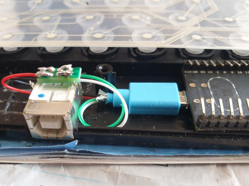

As for the VGA, I decided to go simple, and not use R/2R DACs, and simply connect 6 cables from the ESP to the female VGA: R, G, B, HSync, VSync and ground. I glued some cable ties to the base of the keyboard with superglue, and secured the female VGA connector with cable ties and superglue.

For simplicity, the VGA signal only has 1 bit per color component, thus losing the BRIGHT mode of the Spectrum (it is similar to the BRIGHT mode being always at 1).

The last thing was to mount a double bi-directional logic level converter on a miniature board, which I did not get to the first attempt, the first board did not work, but I got it to the second attempt. I cut the cable from the PS/2 keyboard, peeled it, and soldered it to the converter board, and it worked.

Finally I installed a 3.5mm audio jack, to have sound output. Compared to all of the above, this was much easier.

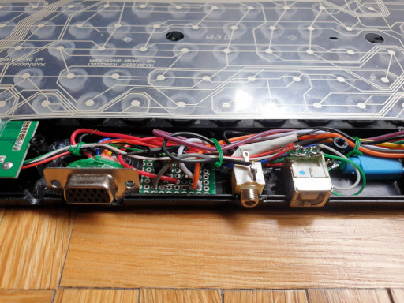

I already had my ESPectrum well finished, with all its wiring hidden inside a mini keyboard, with only three connectors: VGA for video output, 3.5 jack for audio output, and USB-B for power and programming. It was a great satisfaction to contemplate my finished work.

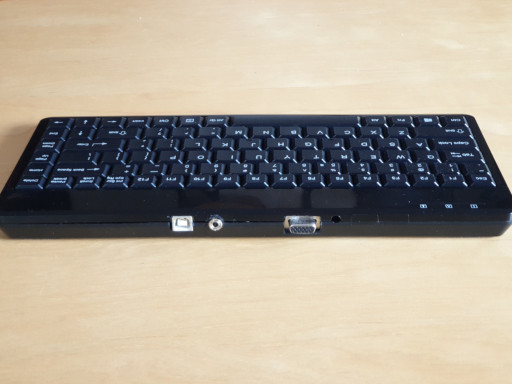

So I got to work on the firmware of the emulator, and added the functionality of saving and loading snapshots at any time, to save the game before entering that difficult screen of Jet Set Willy, and if I fell into an infinite loop of deaths, load game.

I put two snapshot modes: memory (faster) and disk (slower, but was not lost when turning the machine off).

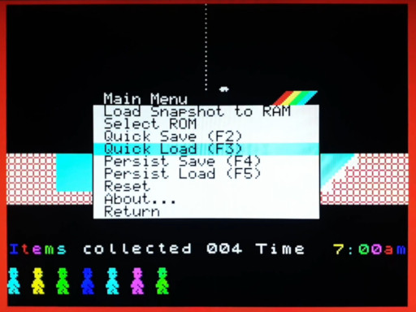

At the end of August 2020 I published my first video about the ESPectrum emulator:

[https://www.youtube.com/watch?v=ROthljwC5OA](https://www.youtube.com/watch?v=ROthljwC5OA)

Checking the about section of Rampa emulator's github repository (the one which I forked) I saw they mentioned "also for TTG VGA32". I investigated and learned they were referring to the Lilygo TTGo VGA32, a board with connectors already soldered (PS/2 and VGA) and costing about 10€.

In September 2020 I got it and I started messing with it.

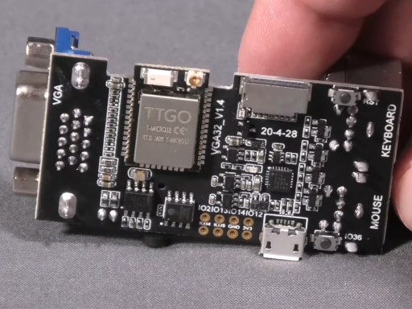

Actually, there was not much to fiddle with, practically everything worked at the first attempt, only change was setting the pin numbers to the ones that the TTGO used.

The TTGO has a D/A converter with 2 bits per color component (RRGGBB), so I integrated a new version of the Bitluni library, for use the VGA6Bit mode, with which I got the BRIGHT attribute back from the spectrum.

In October 2020 I posted my second video about the ESPectrum emulator:

[https://www.youtube.com/watch?v=GXHBrQVTfBw](https://www.youtube.com/watch?v=GXHBrQVTfBw)

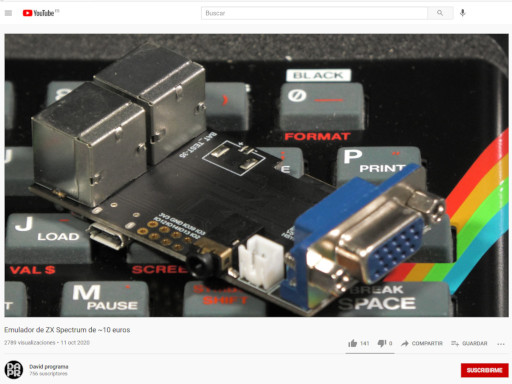

Through the video comments I got in touch with Stormbytes1970 (Paco), with whom I was talking about how to connect a real Spectrum keyboard (48 or 48+) to the ESP using 13 GPIO pins.

Paco opened my eyes with this topic, I thought about it with a programmer's mentality (periodically reading the state of the keyboard and storing it in a buffer), while he had a more electronic mentality, which consisted of intercepting the calls to "read port" of the emulated Spectrum, writing the port number in the 8 output pins on one hand, and on the other hand reading the state of the 5 input pins.

He handed me his code and after a few tests I integrated it into my repository, as one more emulator configuration option, which could or could not be used by changing #defines in a .h header file.

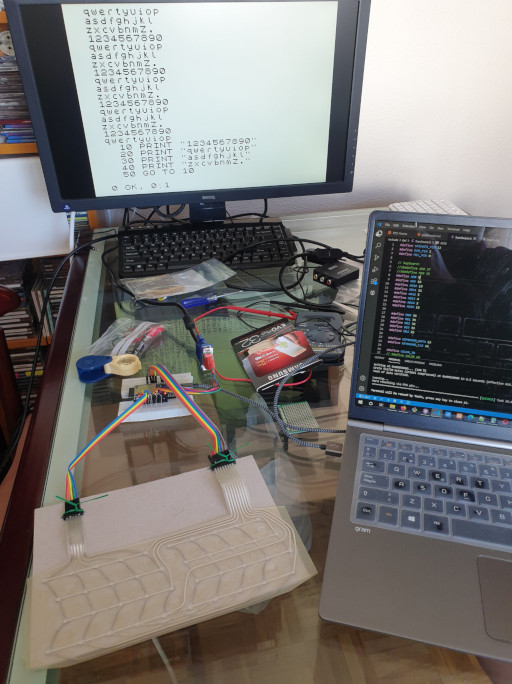

In November 2020 I was investigating a detail that I did not like about the emulator: timing. In some games, the timing was roughly correct. But Manic Miner (my favorite Spectrum game, by the way), was running too fast on the ESPectrum emulator.

I had already noticed that the contended memory wasn't correctly implemented in the emulator. I had fixed some things before, but it was not enough. The contended memory is a mechanism present in Spectrums, so that accesses to the first 16Kb of RAM (where the framebuffer, the graphic memory is housed) are penalized at specific moments of the drawing cycle on the screen. The ULA (the graphics chip) has priority in accessing memory, and if the CPU wants to access those first 16Kb of RAM, the ULA delays the CPU by introducing wait cycles (stopping the clock signal, a "creative" way to do so).

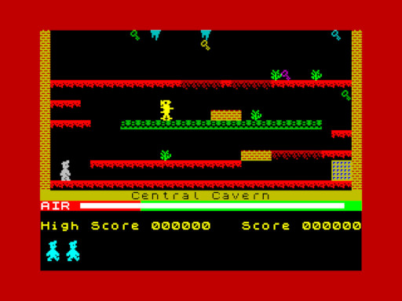

In other games it is not so noticeable, but Manic Miner achieves its flicker-free graphics by drawing the level and the characters in an off-screen buffer which resides in the first 16Kb of RAM, and then copies it to the screen with the LDIR instruction. This instruction undergoes many wait cycles when the source and destination buffers are in the first 16Kb of RAM.

So I correctly implemented the waiting cycles for the LDIR, LDDR, CPIR and CPDR instructions, not for other instructions, since the rules for the waiting cycles must be implemented for each instruction, and I was satisfied that Manic Miner would run at the correct speed.

With so much game testing, I wanted to play it again and I began practicing until I was able to finish the 20 levels without infinite lives or snapshots. I recorded a video of the feat, performed on a Spectrum 48K with rubber keys, connected to a CRT TV, and loading the game from cassette.

[https://www.youtube.com/watch?v=3qQsPtiP_nc](https://www.youtube.com/watch?v=3qQsPtiP_nc)

The same game, but only screen is seen:

[https://www.youtube.com/watch?v=uph2Q00jCfU](https://www.youtube.com/watch?v=uph2Q00jCfU)

The following months I did not spend time on the ESPectrum emulator. I had little time due to a heavy workload.

At the end of February 2021 I returned to the ESPectrum. I made some cases with the 3D printer for putting the TTGo inside.

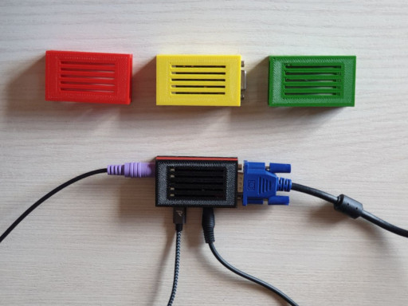

I also purchased a cheap second-hand 17 "(4:3) VGA TFT monitor (10)€ and added support for 4:3 monitors, at 320x240 resolution (until then it only supported 16: 9 monitors at 360x200).

At the request of a user who commented on one of the videos, I added SD card support, which was really easy, since the TTGo comes with a microSD card slot. It was easy to implement, I only had to initialize the SD device support, and then replace the SPIFFS object with the SD object in all disk access calls. You can choose between one or the other by changing a #define in a header file.

In March 2021 I did a refactoring of all the code, unifying the two branches (master and lilygo-ttgo-vga32), which although they are still different branches, share 99.9% of the code (only the pin assignment differs and little else).

With the a clean and tidy code, I added support for the .Z80 file format, much more widespread than the .SNA format I was using so far. I managed to support several versions of .Z80, for Spectrum 48K and 128K, also switching between modes 48 and 128 depending on the type of .Z80 that is being loaded, which they did not do before.

I also added partial support for the Spectrum 128K sound by incomplete emulation of the AY-3-8912 chip. It doesn't sound exactly the same as on a Spectrum, but it is similar (at least the pitch is accurate), and 128K games have some sound.

To be continued... 